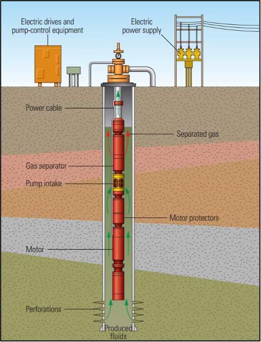

# BPX-Challenge
<div style="display:flex; flex-direction:row; justify-content:flex-start; gap:30px; align-items:top; padding-left:0">
    <p width="300px">
    Electric submersible pumps (ESP) are used to move high volume of fluids in unconventional wells. Each pump has an average run life of 12 months and operators in the Permian Basin report that ~3 pump repairs are required weekly across their active wells. This translates to upwards of $50MM in expenses annually and this challenge is targeted at estimating ESP run life to improve operational efficiency.<br><br>
    We analyzed data from <b>70 wells</b> and trained machine learning models to predict precursory signals several days ahead of an ESP failure event. Additional details on the competition can be found <a src="https://www.spegcs.org/events/6836/">here</a>.
    </p>
    <div style="text-align:center; flex-shrink:0;">
        
        <figcaption>Electric Submersible Pump Schematic</figcaption>
    </div>
</div>


### Team JTK
| Name | Affilation | Email |
| :-- | :-- | :-- |
| Teslim Olayiwola | Louisiana State University | tolayi1@lsu.edu |
| Korede Akinpelu | Louisiana State University | dakinp1@lsu.edu |
| Joses Omojola | University of Arizona | jomojo1@arizona.edu |


### Environment setup
Python virtual environments are used for this project. Execute the commands below in terminal to install all requirements.
```bash
~$chmod +x setup.sh
~$sh setup.sh
~$source jtk/bin/activate
```
Documentation for running the different scripts can be found [here](Documentation.md).


### To-Do
- [x] Complete data cleaning for spikes
- [x] Resample data for cropping
- [x] Crop timeseries for training model
- [x] Handle nan values
- [x] Create model architecture with LSTM
- [x] Improve model architecture - (Limited time for multiple tests)


`num_hidden` is simply the dimension of the hidden state.<br>
The number of hidden layers is something else entirely. You can stack LSTMs on top of each other, 
so that the output of the first LSTM layer is the input to the second LSTM layer and so on. 
The number of hidden layers is how many LSTMs you stack on top of each other.